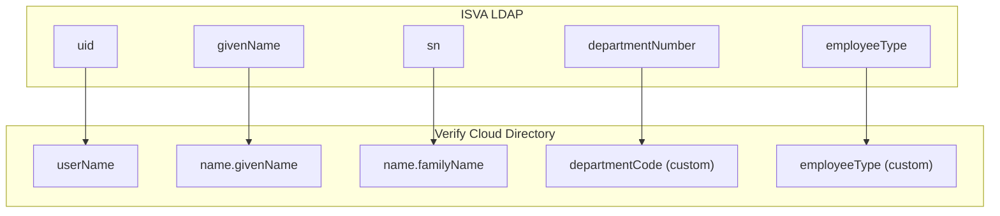

# Directory Attribute Mapping

```mermaid
flowchart TB
    subgraph ISVA_LDAP["ISVA LDAP"]
        uid
        givenName
        sn
        departmentNumber
        employeeType
    end
    subgraph Verify_Directory["Verify Cloud Directory"]
        userName
        vgName[name.givenName]
        vfName[name.familyName]
        deptCode["departmentCode (custom)"]
        empType["employeeType (custom)"]
    end
    uid --> userName
    givenName --> vgName
    sn --> vfName
    departmentNumber --> deptCode
    employeeType --> empType
```