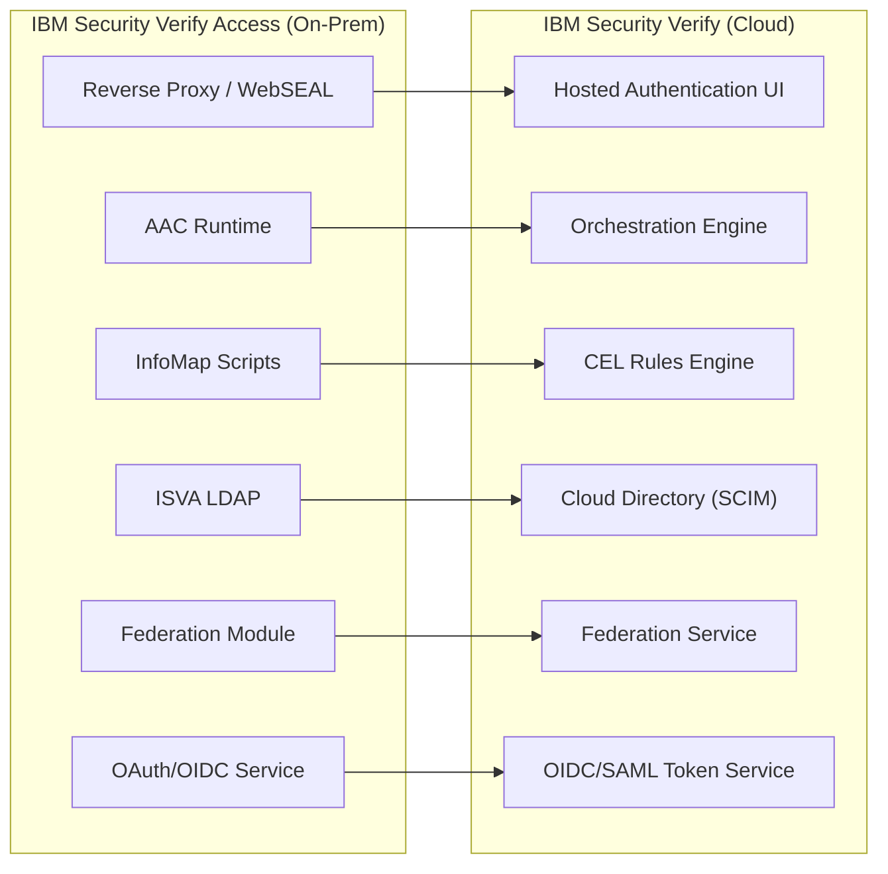

# ISVA to Verify Component Mapping

```mermaid
flowchart LR
    subgraph ISVA["IBM Security Verify Access (On‑Prem)"]
        WGA[Reverse Proxy / WebSEAL]
        AAC[AAC Runtime]
        INFOMAP[InfoMap Scripts]
        ISVA_LDAP[ISVA LDAP]
        FED_MOD[Federation Module]
        OAUTH_SVC[OAuth/OIDC Service]
    end
    subgraph Verify["IBM Security Verify (Cloud)"]
        AUTH_UI[Hosted Authentication UI]
        ORCH[Orchestration Engine]
        CEL[CEL Rules Engine]
        CLOUD_LDAP["Cloud Directory (SCIM)"]
        FED_SVC[Federation Service]
        TOKEN_SVC[OIDC/SAML Token Service]
    end
    WGA --> AUTH_UI
    AAC --> ORCH
    INFOMAP --> CEL
    ISVA_LDAP --> CLOUD_LDAP
    FED_MOD --> FED_SVC
    OAUTH_SVC --> TOKEN_SVC
```