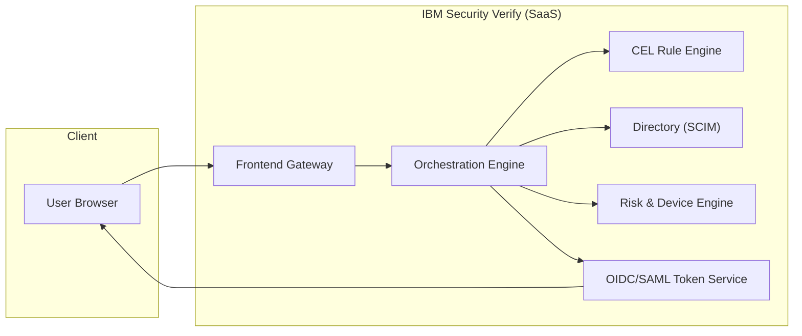

# Verify High-Level Archtecture

```mermaid
flowchart LR
    subgraph Client
        BROWSER[User Browser]
    end
    subgraph IBM_Verify["IBM Security Verify (SaaS)"]
        FE[Frontend Gateway]
        ORCH[Orchestration Engine]
        CEL[CEL Rule Engine]
        TOKEN[OIDC/SAML Token Service]
        DIR["Directory (SCIM)"]
        RISK[Risk & Device Engine]
    end
    BROWSER --> FE
    FE --> ORCH
    ORCH --> CEL
    ORCH --> DIR
    ORCH --> RISK
    ORCH --> TOKEN
    TOKEN --> BROWSER
```